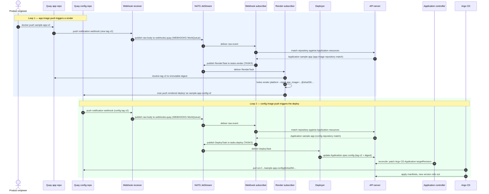

# End-to-End MVP Deployment Flow: Two Registry-Event Loops

| Metadata | Value                            |
|----------|----------------------------------|
| Date     | 2026-06-12                       |
| Author   | @jeffmccune                      |
| Status   | `Proposed`                       |
| Tags     | pipeline, mvp, nats, oci, argocd |
| Updates  | ADR-6, ADR-10, ADR-11            |

| Revision | Date       | Author      | Info           |
|----------|------------|-------------|----------------|
| 1        | 2026-06-12 | @jeffmccune | Initial design |
| 2        | 2026-06-12 | @jeffmccune | Clarify routing invariants and config digest lookup |

## Context and Problem Statement

[ADR-6](ADR-6.md) establishes the MVP pipeline and its NATS backbone, and
[ADR-9](ADR-9.md)/[ADR-10](ADR-10.md)/[ADR-11](ADR-11.md) specify the receive,
parse, and deploy stages. None of them records the **complete end-to-end user
experience** — what happens, hop by hop, between a product engineer's
`docker push` and the new version rolling out. The second half of that path —
rendering CUE, publishing the rendered manifests as an OCI artifact, and Argo
CD syncing it — exists only as deferred notes in ADR-11 and as research
([Argo CD OCI report](../research/argocd-oci-image-tag-updates.md),
[render+publish report](../research/rendered-manifests-publish-pipeline.md)).

What is the authoritative end-to-end flow of the Holos PaaS MVP, and how do
its two halves connect? This flow is the core functionality of the MVP; this
ADR records it as a single design, centered on the sequence diagram below.

## Context / References

- [ADR-6 — MVP Heroku-Style Deployment Pipeline](ADR-6.md) (the pipeline this
  ADR completes end to end)
- [ADR-8 — Container Registry and Image Tagging](ADR-8.md) (the registry as
  artifact store and event source; the tag is the version)
- [ADR-9 — Webhook Receiver: Thin NATS Ingress](ADR-9.md)
- [ADR-10 — Webhook Subscriber: Parse and Dispatch](ADR-10.md)
- [ADR-11 — Deployer Task Subscriber and the Application Resource](ADR-11.md)
- [ADR-2 — Core Platform Principles](ADR-2.md) (the KRM is the primary API)
- [Research: Handling Image-Tag Updates in Argo CD with an OCI Manifest Source](../research/argocd-oci-image-tag-updates.md)
  — concludes Argo CD syncs rendered manifests from an OCI artifact and the
  pipeline sets `Application.targetRevision`
- [Research: Performing the Re-render + ORAS Publish Step in the Event-Driven Pipeline](../research/rendered-manifests-publish-pipeline.md)
  — concludes a dedicated render-task subscriber owns `holos render` + ORAS
  publish; specifies consumer tuning, idempotency, and credentials
- [ORAS](https://oras.land/) — pushes the rendered-manifests directory as an
  OCI artifact
- [Argo CD OCI source](https://argo-cd.readthedocs.io/en/latest/user-guide/oci/)
  (requires Argo CD ≥ 3.1)
- [Red Hat Quay repository push payload](https://docs.redhat.com/en/documentation/red_hat_quay/2.9/html-single/use_red_hat_quay/index#repository-events)
  — the documented payload carries `updated_tags`, not a manifest digest

## Design

### One event source, two loops

The flow is **two consecutive loops through the same pipeline
infrastructure**. Quay is the single event source ([ADR-8](ADR-8.md)): every
repository push — application image or configuration image — fires a
repository push notification into the same thin receiver
([ADR-9](ADR-9.md)) and the same `WEBHOOKS` WorkQueue stream. The webhook
subscriber ([ADR-10](ADR-10.md)) routes each event by matching the event's
repository against `Application` resources ([ADR-11](ADR-11.md)):

- **Loop 1 (render):** the event repository matches an `Application`'s
  **app image repository** → publish a *render task*. The render subscriber
  renders the platform CUE with the new tag injected and pushes the rendered
  YAML to the application's **configuration repository** as an OCI artifact.
- **Loop 2 (deploy):** the event repository matches an `Application`'s
  **configuration repository** → publish a *deployer task*. The deployer
  updates the `Application` resource with the new configuration image
  version; the `Application` controller patches the Argo CD `Application`'s
  `targetRevision`, and Argo CD pulls the new configuration image and applies
  it.

The seam between the loops is the **registry itself**: loop 1 ends with an
OCI push, and that push's notification starts loop 2. Nothing in loop 1 talks
to the deployer directly.

### Repository routing invariants

The subscriber does **not** fan out one repository event to multiple
applications in the MVP. `Application` admission must enforce these invariants
on normalized repository names (`<registry>/<namespace>/<repository>`, without
tag or digest):

- `spec.image.repository` is unique across all watched `Application` resources.
- `spec.config.repository` is unique across all watched `Application` resources.
- No repository may appear as both an app image repository and a configuration
  repository, including within the same `Application`.

The webhook subscriber builds two informer-backed indexes:
`appRepository -> Application` and `configRepository -> Application`. A Quay
event repository must match **exactly one** index entry and exactly one index:
app-repository matches emit render tasks, config-repository matches emit deploy
tasks. No match is acked and dropped as an unmanaged repository. More than one
match, or a repository present in both indexes, is an invalid platform
configuration; the subscriber publishes the raw event plus the matched
`Application` identities to the dead-letter subject and terminates the message
rather than guessing or duplicating deployments.

### Sequence diagram

This diagram is the core of the MVP design. Steps 1–11 of the user-visible
flow are mapped to components in the table that follows.

### Step-by-step mapping

| #  | User-visible step                          | Component                          | Subject / repository                         |
|----|--------------------------------------------|------------------------------------|----------------------------------------------|
| 1  | `docker push` of a new app image tag       | Product engineer                   | Quay app repo (e.g. `holos/sample-app:v2`)    |
| 2  | Push-notification webhook for the new tag  | Quay ([ADR-8](ADR-8.md))           | `POST /webhooks/quay`                         |
| 3  | Raw event published to NATS                | Receiver ([ADR-9](ADR-9.md))       | `webhooks.quay` on `WEBHOOKS` (WorkQueue)     |
| 4  | Event matched to a managed application     | Subscriber ([ADR-10](ADR-10.md))   | `Application.spec` app image repository       |
| 5  | CUE template rendered with the new tag     | Render subscriber (this ADR)       | `holos render platform --inject`              |
| 6  | Rendered YAML stored as an OCI image       | Render subscriber (ORAS)           | local `deploy/` → OCI artifact                |
| 7  | Config image pushed to a sibling repo      | Render subscriber                  | Quay config repo (`holos/sample-app-config:v2`) |
| 8  | Push-event webhook for the config image    | Quay                               | `POST /webhooks/quay`                         |
| 9  | Relayed to NATS                            | Receiver ([ADR-9](ADR-9.md))       | `webhooks.quay` on `WEBHOOKS` (WorkQueue)     |
| 10 | Config tag matched against the KRM object  | Subscriber + deployer ([ADR-11](ADR-11.md)) | `Application.spec` config repository → `tasks.deploy` |
| 11 | Argo CD fetches the config image, applies  | Application controller + Argo CD   | `targetRevision` → `oci://…-config@sha256:…`  |

### Loop 1 — render and publish

**Matching (step 4).** The webhook subscriber parses the Quay repository-push
payload into `(repository, tags)` and consults `Application` resources via an
informer cache (read-only access). The repository routing invariants above
ensure one event maps to one `Application` and one loop. An event whose
repository equals the matched `Application`'s app image repository produces one
`RenderTask` per pushed tag on `tasks.render`; an event matching no
`Application` is acked and dropped with a log line; an unparseable or ambiguous
body goes to the dead-letter subject (see failure table). The `RenderTask`
carries the application identity (name/namespace), repository, tag, and an
idempotency key derived from the source event.

**Render (step 5).** The render subscriber is the dedicated slow stage from
the [render+publish report](../research/rendered-manifests-publish-pipeline.md).
It resolves the pushed tag to its immutable digest, then runs
`holos render platform --inject app_image=<repo>@<digest>` so the rendered
YAML pins the exact image. For the MVP the platform CUE configuration is
**baked into the render subscriber's container image** (config version =
image version); publishing the config tree as its own OCI artifact is the
recorded growth path, not MVP scope.

**Package and push (steps 6–7).** The rendered `deploy/` tree is packaged
with `oras-go` (default directory media type
`application/vnd.oci.image.layer.v1.tar+gzip`, which Argo CD's OCI source
accepts for plain manifests) and pushed to the application's
**configuration repository**: a sibling Quay repository named
`<app-repository>-config`, created alongside the app repository with the same
push-notification webhook configured. The config artifact's **tag mirrors the
app image tag** (`v2` → `v2`), which keeps the loop-2 event trivially
correlatable with the app version. Mirrored tags are only the human-readable
correlation handle — the value Argo CD deploys is the immutable **digest**
captured at push time.

**Idempotency.** Delivery is at-least-once at every hop, and OCI pushes are
not byte-reproducible, so the render subscriber uses a **digest-verified
tag-exists fast path**. At push time it stamps the config artifact's manifest
with annotations recording its inputs: the rendered app-image digest
(`holos.run/app-image-digest`) and the platform-config version (the render
subscriber's own image digest while the config is image-baked). On a
`RenderTask` it resolves the target config tag in the registry and compares
those annotations against the freshly resolved inputs:

- **Tag exists and the inputs match** → skip the render entirely; the
  artifact for this exact input already exists. A redelivered `RenderTask`
  converges without a second render.
- **Tag exists but the inputs differ** (a reused or moved app tag — e.g.
  `latest`, or a re-pushed `v2` — or a platform-config change) → render and
  push, moving the config tag to the new artifact. The mirrored tag alone is
  **never** trusted as proof of freshness.
- **Tag absent** → render and push.

[ADR-8](ADR-8.md)'s immutable-tag preference makes the mismatch case the
exception, but the digest comparison keeps the pipeline correct even for
mutable tags. The input-addressed tagging scheme from the
[render+publish report](../research/rendered-manifests-publish-pipeline.md)
(`render-<config-digest>-<image-digest>`) is the recorded alternative if
mirrored tags prove confusing once the platform config becomes its own OCI
artifact. Either way, loop 2 deploys the **digest**, so a stale tag can
mislabel but never mis-deploy. At most a redelivery re-fires the loop-2
notification, which the deployer absorbs (below).

### Loop 2 — deploy

**Matching (step 10).** The config-image push travels the identical path:
Quay notification → receiver → `webhooks.quay` → webhook subscriber. This
time the event's repository matches exactly one `Application`'s configuration
repository, so the subscriber publishes a `DeployTask` on `tasks.deploy`.
Because Quay's documented repository-push payload carries `updated_tags` but no
manifest digest, the subscriber resolves each tag before publishing the task:
it uses a read-only registry credential for configuration repositories and
performs an OCI Distribution `HEAD`/resolve operation against
`<config-repository>:<tag>` to read the `Docker-Content-Digest` descriptor. The
`DeployTask` carries the matched `Application` identity, the config repository,
the tag, the resolved digest, and the source-event idempotency key. The
`Application` resource is the **KRM configuration object** that indicates which
Argo CD `Application` to update: its spec names both repositories and
references its Argo CD `Application`, so the same object routes both loops.

Digest lookup failures are handled before task publication. Authentication or
authorization failure is deterministic platform misconfiguration: publish the
event and error to the dead-letter subject and `Term()` the raw event. A missing
tag/digest or registry 5xx/timeout is retried with `Nak()`/backoff under the
webhook subscriber's delivery policy because Quay may deliver the notification
before the tag is immediately readable; after `MaxDeliver` the subscriber
dead-letters the event with the attempted repository and tag. The subscriber
acks only after every tag in the payload has either produced a deploy task or
has been explicitly dead-lettered.

**Deploy (step 11).** The deployer stays exactly as decided in
[ADR-11](ADR-11.md): a tiny, idempotent KRM writer. It updates the
`Application` resource's config-image version (tag + digest) and acks.
Writing the same version twice is a no-op, which is what absorbs redelivered
tasks and re-fired notifications. The `Application` controller reconciles
that spec by patching the Argo CD `Application`'s source to
`oci://<registry>/<app>-config` with `targetRevision` set to the **digest**
(research Option 1). Argo CD detects the change, pulls the artifact, and
applies the manifests — the new version rolls out. This moves the OCI
rendered-manifests delivery that ADR-11 deferred **into the MVP**; what
remains deferred is Git write-back, not OCI delivery.

### Why loop 2 is webhook-driven

The [render+publish report](../research/rendered-manifests-publish-pipeline.md)
sketched the render subscriber publishing the deployer task directly
(render → `tasks.deploy`, no second webhook). This ADR instead routes loop 2
through the registry notification, deliberately:

- **The registry is the single event source** ([ADR-8](ADR-8.md)) for every
  deployment-triggering fact. "A config image appeared" is the trigger, not
  "our renderer finished" — so a config image pushed by *any* producer
  (the render subscriber, a platform engineer's break-glass `oras push`, a
  future CI system) deploys through the same audited path with no special
  cases.
- **The loops stay independently testable and recoverable.** Loop 2 can be
  exercised by pushing a config artifact by hand; a stalled loop 2 is
  re-triggered by re-pushing the artifact, without re-rendering.
- The cost is one extra webhook round-trip (milliseconds against a render
  measured in seconds to minutes) and a dependency on Quay notification
  delivery for the second hop as well as the first. Quay retries failed
  notifications; if its delivery proves unreliable in practice, the recorded
  fallback is the report's direct `tasks.deploy` publish from the render
  subscriber — a one-stage change that touches neither neighbor.

### Failure and ack semantics

Every hop is at-least-once; every consumer is durable on a file-backed
WorkQueue stream ([ADR-6](ADR-6.md)). Per hop:

| Hop | Consumer behavior |
|-----|-------------------|
| Receiver → `webhooks.quay` | Publish-then-ack to Quay; a JetStream publish failure returns 5xx so Quay retries ([ADR-9](ADR-9.md)). |
| Webhook subscriber | Parse, match, resolve required digests, publish task, ack. Unparseable body or ambiguous repository match → dead-letter publish then `Term()`. No `Application` match → ack and drop (logged). Config digest lookup authz/authn failure → dead-letter then `Term()`; missing tag or registry transient → `Nak()` with backoff, then dead-letter after `MaxDeliver`. |
| Render subscriber | Pull consumer, `AckExplicit`, `MaxAckPending=1`; `AckWait` ≈ 60s with `InProgress()` heartbeats during render+push; `MaxDeliver` ≈ 5 with backoff; deterministic render failure → dead-letter then `Term()`. Ack only after the push succeeds. The digest-verified tag-exists fast path makes redelivery cheap. |
| Deployer | Single idempotent KRM write; same version → no-op; ack after write ([ADR-11](ADR-11.md)). |
| Argo CD | Digest-pinned `targetRevision`; no polling; sync retries are Argo CD's own. |

> **Planning note for the milestone:** specify the `Application` schema
> fields this flow relies on (app image repository, config repository —
> defaulting to `<app-repository>-config` — Argo CD `Application` reference,
> repository-uniqueness admission, and deployed-version status) in the
> follow-up `Application` ADR that
> [ADR-11](ADR-11.md) already calls for; the exact `WEBHOOKS`/`TASKS` stream
> and consumer configuration; Quay notification authentication at the
> receiver; read-only registry credentials for subscriber digest lookups;
> provisioning of the config repository and its webhook alongside the app
> repository; and verification of the digest `targetRevision` syntax against
> the deployed Argo CD version (≥ 3.1).

## Decision

1. The MVP's core functionality is the **two-loop flow recorded in the
   sequence diagram above**: an app-image push renders and publishes a
   configuration image (loop 1); the configuration-image push updates the
   `Application` and Argo CD rolls out the new version (loop 2).
2. **Quay repository push notifications trigger both loops.** The registry is
   the single event source ([ADR-8](ADR-8.md)); both loops share the thin
   receiver ([ADR-9](ADR-9.md)), the `WEBHOOKS` WorkQueue stream, and the
   webhook subscriber ([ADR-10](ADR-10.md)).
3. The webhook subscriber **routes by KRM match**: an event repository
   matching exactly one `Application`'s app image repository emits a
   `RenderTask` on `tasks.render`; matching exactly one configuration
   repository emits a `DeployTask` on `tasks.deploy`. Repository uniqueness is
   enforced by `Application` admission; ambiguous matches are dead-lettered,
   never fanned out.
4. A dedicated **render subscriber** renders the platform CUE with
   `holos render platform --inject` (digest-pinned app image) and pushes the
   rendered `deploy/` tree with ORAS to the sibling configuration repository
   `<app-repository>-config`, tagged to mirror the app image tag and
   annotated with its input digests. Idempotency is the **digest-verified**
   tag-exists fast path — input annotations must match, the mirrored tag
   alone is never trusted — not byte-reproducible artifacts.
5. The deployer updates the `Application` resource's config-image version;
   the `Application` controller patches the Argo CD `Application`'s
   `targetRevision` to the artifact **digest**, and Argo CD syncs the OCI
   source. **OCI rendered-manifests delivery is MVP scope**, refining
   ADR-11's deferral; Git write-back and separation-of-duty promotion gating
   remain deferred.
6. ADR-6's five-stage enumeration is refined to **six stages**: build → push
   → receive → parse/route → **render & publish** → deploy.

## Consequences

- The user experience is exactly the Heroku-style promise: `docker push` a
  tag, watch the new version roll out — with every intermediate hop durable,
  observable, and replayable.
- Argo CD (≥ 3.1, OCI source enabled) becomes an MVP operational dependency,
  not a deferred one; the platform must deploy and operate it.
- Each application owns **two Quay repositories** (app and `-config`), both
  with push notifications; provisioning them and their webhooks is part of
  application onboarding.
- Deployment latency includes two webhook round-trips and one full
  `holos render platform`; the render dominates. A missed Quay notification
  stalls the corresponding loop until Quay's retry or a re-push — acceptable
  for the MVP, with the direct-publish fallback recorded above.
- Credential separation is clean: only the render subscriber holds a registry
  **push** credential; the deployer holds only Kubernetes RBAC; Argo CD holds
  only a **pull** credential for the config repositories.
- Mirrored mutable tags make loops easy to correlate, but the deployed truth
  is always the immutable digest in `targetRevision`
  ([ADR-8](ADR-8.md)'s digest-pinning preference).
- The `Application` resource gains load-bearing routing duties (both
  repository fields); its schema ADR ([ADR-11](ADR-11.md)'s planning note)
  must specify them before the subscribers can be built.
